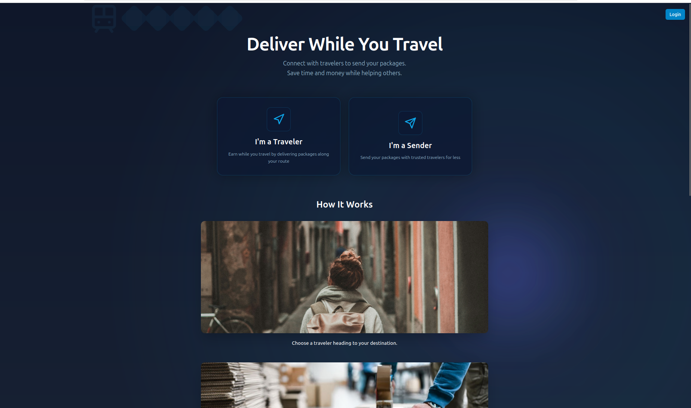
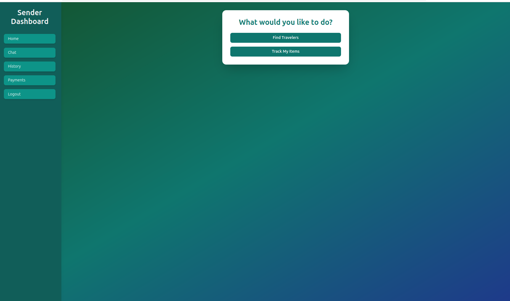
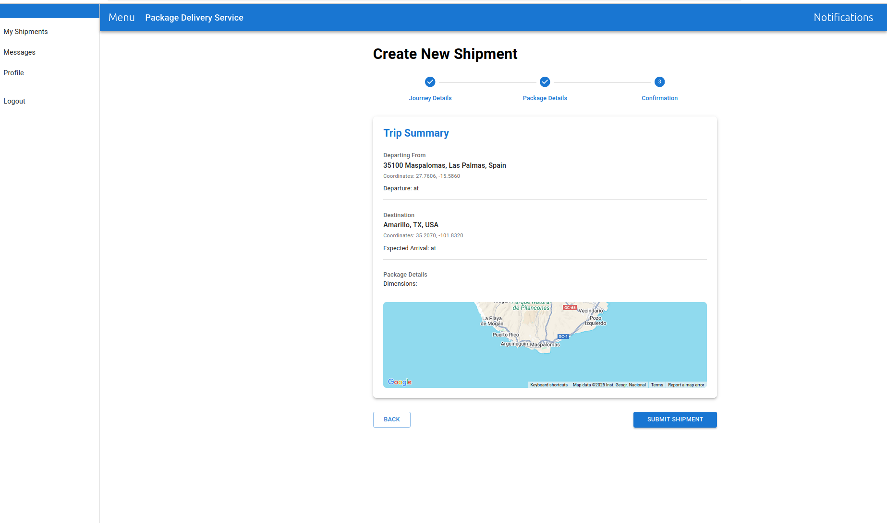
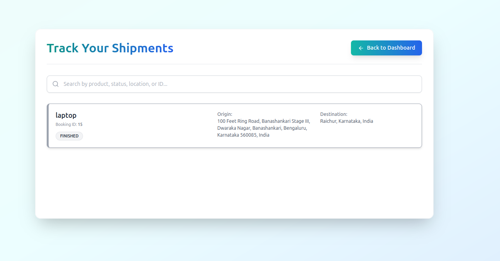
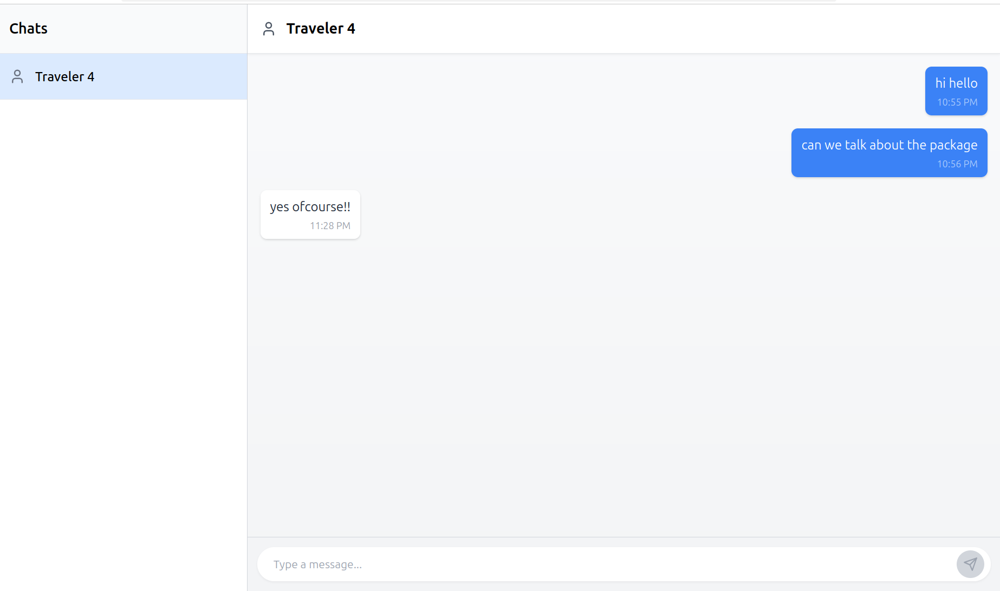

# Deliver While You Travel 🚀📦

A innovative platform that connects travelers with senders who need to transport small packages, providing a cost-effective and efficient alternative to traditional courier services.

## 📋 Table of Contents

- [Overview](#overview)
- [Features](#features)
- [Technologies Used](#technologies-used)
- [Architecture](#architecture)
- [Project Structure](#project-structure)
- [Prerequisites](#prerequisites)
- [Installation & Setup](#installation--setup)
- [Usage](#usage)
- [Screenshots](#screenshots)
- [API Documentation](#api-documentation)
- [Contributing](#contributing)
- [License](#license)
- [Contact](#contact)

## 🌟 Overview

Deliver While You Travel is a peer-to-peer package delivery platform that leverages the power of crowdsourcing. Travelers can monetize their journeys by delivering packages along their route, while senders get affordable and reliable package delivery services.

### How It Works

1. **Travelers** post their travel itineraries with available space
2. **Senders** search for travelers going to their desired destination
3. **Matching** occurs based on route, timing, and package requirements
4. **Secure transactions** through integrated payment system
5. **Real-time tracking** of shipments throughout the journey

## ✨ Features

### Core Features
- 👤 **User Management**
  - Dual registration system (Traveler/Sender)
  - Profile management with Aadhar verification
  - Photo upload and identity verification
  
- 🗺️ **Travel & Search**
  - Post travel details with route information
  - Advanced search filters by source and destination
  - Real-time availability updates
  
- 💼 **Booking System**
  - Easy booking interface for senders
  - Booking confirmation and management
  - Delivery history tracking
  
- 💳 **Payment Integration**
  - Secure payment gateway
  - Multiple payment options
  - Transaction history
  
- 📱 **Communication**
  - In-app messaging system (planned)
  - Notification system
  - Real-time updates

### Security Features
- 🔐 Aadhar-based identity verification
- 📸 Photo verification system
- 🛡️ Secure payment processing
- 📊 User rating and review system

## 🛠️ Technologies Used

### Frontend
- **Framework:** React.js
- **Package Manager:** npm
- **Build Tool:** Vite (recommended) / Create React App
- **Styling:** CSS3 / Styled Components
- **State Management:** React Hooks / Context API

### Backend
- **Framework:** Spring Boot (Java)
- **Build Tool:** Maven
- **Security:** Spring Security
- **Data Access:** Spring Data JPA
- **Authentication:** JWT (JSON Web Tokens)

### Database
- **Primary:** MySQL / PostgreSQL
- **Development:** H2 (in-memory database)
- **ORM:** Hibernate (via Spring Data JPA)

### Development Tools
- **Version Control:** Git
- **Code Quality:** Lombok
- **Testing:** JUnit, Mockito
- **Documentation:** Swagger/OpenAPI

## 🏗️ Architecture

The application follows a **Model-View-Controller (MVC)** architecture pattern with clear separation of concerns:

```
┌─────────────────┐    HTTP/REST    ┌─────────────────┐
│   React Frontend │ ◄──────────────► │ Spring Boot API │
│   (Port 3000)    │                 │   (Port 8080)   │
└─────────────────┘                 └─────────────────┘
                                              │
                                              ▼
                                    ┌─────────────────┐
                                    │   SQL Database  │
                                    │ (MySQL/PostgreSQL)│
                                    └─────────────────┘
```

### Design Patterns Used
- **Repository Pattern** for data access layer
- **Service Layer Pattern** for business logic
- **Dependency Injection** via Spring Framework
- **MVC Pattern** for web layer organization

## 📁 Project Structure

```
Deliver-While-You-Commute/
├── 📁 demo/                          # Spring Boot Backend
│   ├── 📁 src/
│   │   ├── 📁 main/
│   │   │   ├── 📁 java/
│   │   │   │   └── 📁 com/deliverwhileyoutravel/
│   │   │   │       ├── 📁 controller/    # REST Controllers
│   │   │   │       ├── 📁 service/       # Business Logic
│   │   │   │       ├── 📁 repository/    # Data Access Layer
│   │   │   │       ├── 📁 model/         # Entity Classes
│   │   │   │       ├── 📁 dto/           # Data Transfer Objects
│   │   │   │       ├── 📁 config/        # Configuration Classes
│   │   │   │       └── 📁 security/      # Security Configuration
│   │   │   └── 📁 resources/
│   │   │       ├── application.properties
│   │   │       └── 📁 static/
│   │   └── 📁 test/                      # Unit Tests
│   └── pom.xml                           # Maven Configuration
├── 📁 project/                           # React Frontend
│   ├── 📁 public/
│   │   ├── index.html
│   │   └── favicon.ico
│   ├── 📁 src/
│   │   ├── 📁 components/                # Reusable Components
│   │   ├── 📁 pages/                     # Page Components
│   │   ├── 📁 services/                  # API Services
│   │   ├── 📁 hooks/                     # Custom Hooks
│   │   ├── 📁 utils/                     # Utility Functions
│   │   ├── 📁 styles/                    # CSS Files
│   │   ├── App.js
│   │   └── index.js
│   ├── package.json                      # npm Configuration
│   └── .env                              # Environment Variables
├── 📁 docs/                              # Documentation
├── 📸 front.png                          # UI Screenshots
├── 📸 sender.png
├── 📸 traveler.png
├── 📸 track_my_shpipmets.png
├── 📸 chat_interface.png
└── README.md
```

## 📋 Prerequisites

Before running this application, make sure you have the following installed:

- **Java Development Kit (JDK) 11 or higher**
  ```bash
  java -version
  ```

- **Maven 3.6 or higher**
  ```bash
  mvn -version
  ```

- **Node.js 14 or higher and npm**
  ```bash
  node -version
  npm -version
  ```

- **MySQL or PostgreSQL Database Server**
  - MySQL 8.0+ or PostgreSQL 12+
  - Database client (MySQL Workbench, pgAdmin, etc.)

- **Git** (for cloning the repository)
  ```bash
  git --version
  ```

## 🚀 Installation & Setup

### Step 1: Clone the Repository

```bash
git clone https://github.com/chidanand111/Deliver-While-You-Commute.git
cd Deliver-While-You-Commute
```

### Step 2: Database Setup

#### For MySQL:
```sql
-- Create database
CREATE DATABASE deliver_while_you_travel_db;

-- Create user (optional)
CREATE USER 'deliver_user'@'localhost' IDENTIFIED BY 'your_password';
GRANT ALL PRIVILEGES ON deliver_while_you_travel_db.* TO 'deliver_user'@'localhost';
FLUSH PRIVILEGES;
```

#### For PostgreSQL:
```sql
-- Create database
CREATE DATABASE deliver_while_you_travel_db;

-- Create user (optional)
CREATE USER deliver_user WITH ENCRYPTED PASSWORD 'your_password';
GRANT ALL PRIVILEGES ON DATABASE deliver_while_you_travel_db TO deliver_user;
```

### Step 3: Backend Configuration

1. **Navigate to backend directory:**
   ```bash
   cd demo
   ```

2. **Configure database connection:**
   
   Edit `src/main/resources/application.properties`:

   **For MySQL:**
   ```properties
   # Database Configuration
   spring.datasource.url=jdbc:mysql://localhost:3306/deliver_while_you_travel_db
   spring.datasource.username=deliver_user
   spring.datasource.password=your_password
   spring.datasource.driver-class-name=com.mysql.cj.jdbc.Driver

   # JPA Configuration
   spring.jpa.hibernate.ddl-auto=update
   spring.jpa.show-sql=true
   spring.jpa.properties.hibernate.format_sql=true
   spring.jpa.database-platform=org.hibernate.dialect.MySQL8Dialect

   # Server Configuration
   server.port=8080

   # JWT Configuration
   app.jwt.secret=your-secret-key
   app.jwt.expiration=86400000

   # File Upload Configuration
   spring.servlet.multipart.max-file-size=10MB
   spring.servlet.multipart.max-request-size=10MB
   ```

   **For PostgreSQL:**
   ```properties
   # Database Configuration
   spring.datasource.url=jdbc:postgresql://localhost:5432/deliver_while_you_travel_db
   spring.datasource.username=deliver_user
   spring.datasource.password=your_password
   spring.datasource.driver-class-name=org.postgresql.Driver

   # JPA Configuration
   spring.jpa.hibernate.ddl-auto=update
   spring.jpa.show-sql=true
   spring.jpa.properties.hibernate.format_sql=true
   spring.jpa.database-platform=org.hibernate.dialect.PostgreSQLDialect

   # Server Configuration
   server.port=8080

   # JWT Configuration
   app.jwt.secret=your-secret-key
   app.jwt.expiration=86400000

   # File Upload Configuration
   spring.servlet.multipart.max-file-size=10MB
   spring.servlet.multipart.max-request-size=10MB
   ```

3. **Install dependencies and build:**
   ```bash
   mvn clean install
   ```

### Step 4: Frontend Configuration

1. **Navigate to frontend directory:**
   ```bash
   cd ../project
   ```

2. **Install dependencies:**
   ```bash
   npm install
   ```

3. **Configure environment variables:**
   
   Create `.env` file in the `project` directory:
   ```env
   REACT_APP_API_BASE_URL=http://localhost:8080/api
   REACT_APP_APP_NAME=Deliver While You Travel
   REACT_APP_VERSION=1.0.0
   ```

### Step 5: Running the Application

#### Terminal 1 - Backend Server:
```bash
cd demo
mvn spring-boot:run
```
The backend will start on `http://localhost:8080`

#### Terminal 2 - Frontend Development Server:
```bash
cd project
npm run dev
```
The frontend will start on `http://localhost:3000` or `http://localhost:5173` (check console)

### Step 6: Verify Installation

1. **Backend Health Check:**
   ```bash
   curl http://localhost:8080/actuator/health
   ```

2. **Frontend Access:**
   Open your browser and navigate to the frontend URL provided in the terminal.

## 💻 Usage

### For Travelers:
1. **Register** as a traveler with your travel details
2. **Verify** your identity with Aadhar and photo
3. **Post** your travel itinerary with available space
4. **Receive** booking requests from senders
5. **Accept** bookings and coordinate pickup/delivery
6. **Complete** deliveries and receive payments

### For Senders:
1. **Register** as a sender on the platform
2. **Search** for travelers going to your destination
3. **View** traveler profiles and ratings
4. **Book** a suitable traveler for your package
5. **Make** secure payment through the platform
6. **Track** your package throughout the journey

## 📸 Screenshots

### Main Interface

*The main dashboard showing available options for both travelers and senders*

### Sender Dashboard

*Sender interface for searching travelers and managing bookings*

### Traveler Dashboard

*Traveler interface for posting trips and managing deliveries*

### Shipment Tracking

*Real-time tracking system for monitoring package deliveries*

### Communication System

*In-app messaging system for traveler-sender communication*

## 📚 API Documentation

### Authentication Endpoints
```http
POST /api/auth/register
POST /api/auth/login
POST /api/auth/refresh
```

### User Management
```http
GET    /api/users/profile
PUT    /api/users/profile
POST   /api/users/upload-photo
POST   /api/users/verify-aadhar
```

### Travel Management
```http
GET    /api/travels
POST   /api/travels
PUT    /api/travels/{id}
DELETE /api/travels/{id}
GET    /api/travels/search
```

### Booking Management
```http
GET    /api/bookings
POST   /api/bookings
PUT    /api/bookings/{id}
GET    /api/bookings/history
```

### Payment Processing
```http
POST   /api/payments/process
GET    /api/payments/history
POST   /api/payments/refund
```

For detailed API documentation, visit: `http://localhost:8080/swagger-ui.html` (when running)

## 🤝 Contributing

We welcome contributions to improve the platform! Here's how you can contribute:

### Development Process

1. **Fork the repository**
   ```bash
   git clone https://github.com/yourusername/Deliver-While-You-Commute.git
   ```

2. **Create a feature branch**
   ```bash
   git checkout -b feature/amazing-feature
   ```

3. **Make your changes**
   - Follow the existing code style and conventions
   - Write unit tests for new features
   - Update documentation as needed

4. **Commit your changes**
   ```bash
   git commit -m "Add: amazing new feature"
   ```

5. **Push to your branch**
   ```bash
   git push origin feature/amazing-feature
   ```

6. **Open a Pull Request**
   - Provide a clear description of the changes
   - Include screenshots for UI changes
   - Reference any related issues

### Coding Standards

#### Backend (Java/Spring Boot):
- Follow Java naming conventions
- Use meaningful variable and method names
- Write comprehensive unit tests
- Document complex business logic
- Use Spring Boot best practices

#### Frontend (React):
- Use functional components with hooks
- Follow React best practices
- Write reusable components
- Use meaningful component and variable names
- Implement proper error handling

### Areas for Contribution

- 🔧 **Bug Fixes**: Report and fix bugs
- 🆕 **New Features**: Add new functionality
- 📚 **Documentation**: Improve documentation
- 🧪 **Testing**: Add test coverage
- 🎨 **UI/UX**: Enhance user interface
- 🔒 **Security**: Improve security measures
- ⚡ **Performance**: Optimize performance

## 📄 License

This project is licensed under the MIT License - see the [LICENSE](LICENSE) file for details.

## 👥 Contact

### Developers

**Basavaraj Nayak**
- 📧 Email: bbasavarajnayak64@gmail.com
- 🐙 GitHub: [imbasava](https://github.com/imbasava)

**Chidanand**
- 📧 Email: chidanandagl11@gmail.com
- 🐙 GitHub: [chidanand111](https://github.com/chidanand111)

### Project Links

- 🌐 **Repository**: [https://github.com/chidanand111/Deliver-While-You-Commute](https://github.com/chidanand111/Deliver-While-You-Commute)
- 📋 **Issues**: [Report Issues](https://github.com/chidanand111/Deliver-While-You-Commute/issues)
- 💡 **Feature Requests**: [Request Features](https://github.com/chidanand111/Deliver-While-You-Commute/issues/new)

---

## 🙏 Acknowledgments

- Thanks to all contributors who have helped shape this project
- Special thanks to the open-source community for the amazing tools and libraries
- Inspired by the sharing economy and sustainable transportation initiatives

---

**Made with ❤️ by the Deliver While You Travel Team**

*Building bridges between travelers and communities, one package at a time.*
